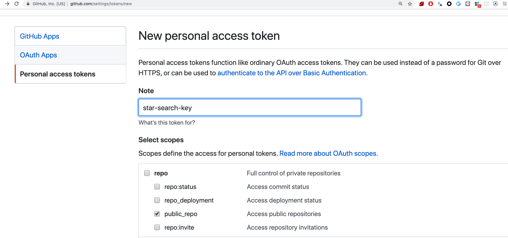

## Motivation

I need to search repos I added star before but github didn't provide this filter.

## Usage

Apply for github personal access token from `https://help.github.com/en/articles/creating-a-personal-access-token-for-the-command-line`. Rename `.env.example` file to `.env` and Add token to `.env` file.

`$npm start`

## Github personal access token permission 

public_repo permission required only

