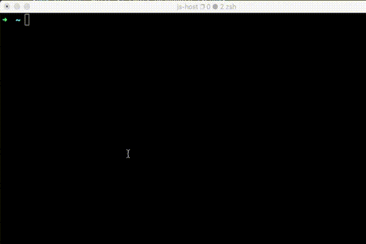

# github-star-search

Search your github starred repositories offline through `README` , `description` and other fields.



## Usage

[Generate new token](https://github.com/settings/tokens) with `public_repo` -> `Access public repositories` permission.

```sh
npm i -g @jasonhsieh/star-search
star-search
```

## Features

-   Search through `readme` and `url`, `homepageUrl`, `name`, `description` text offline.

-   Fuzzy search by [fuse.js](https://fusejs.io/). Exact match by adding double quote `"` like `"express.js"`.

-   Check new starred repos and update at most once daily while running

-   Select and open in browser. `Arrow Up`, `Arrow Down`, `Page Down`, `Page Up` and `Enter` to open in browser.

## Why?

Github [filter](https://github.com/tj?tab=stars) not support search through `README` content yet.

## License

MIT

## Credits

interactive UI mostly direct from [wiki-cil](https://github.com/hexrcs/wiki-cli)
